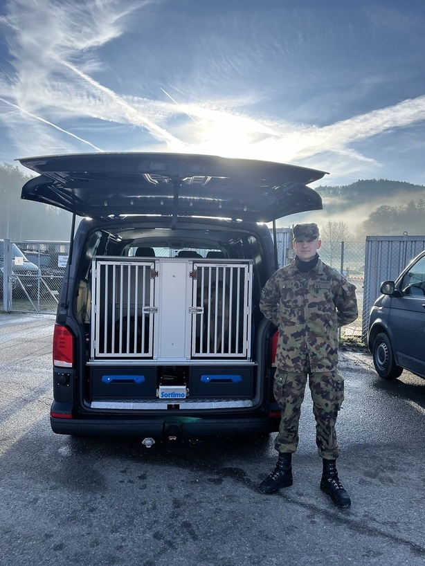

+++
title = "Militär - der richtige Ort für Tiere?"
date = "2024-04-29"
draft = false
pinned = false
tags = []
image = ""
description = " "
footnotes = "Quellen:\\\n<https://de.wikipedia.org/wiki/Pferde_der_Wehrmacht#:~:text=Insgesamt%20wurden%20auf%20deutscher%20Seite,der%20Pferde%20des%20Heeres%20verendeten>.\n\n[https://de.wikipedia.org/wiki/Tiere_im_Militär](https://de.wikipedia.org/wiki/Tiere_im_Milit%C3%A4r)\n\n<https://de.wikipedia.org/wiki/Diensthund#:~:text=In%20Deutschland%20wurden%20Diensthunde%20erst,1.%20Oktober%201901%20stattgefunden%20haben>.\n\n<https://www.tagesspiegel.de/gesellschaft/panorama/wie-tiere-im-militar-eingesetzt-werden-5695306.html>"
+++
### **Tiere im Militär: Ihre Arbeit und Ausbildung**

Für viele Menschen ist die Information, dass es Tiere im Militär gibt, eine Neuigkeit. Die häufig vergessene Arbeit der Militärtiere wird oft unterschätzt, oder verglichen mit der Arbeit von Polizeitieren. Auch gibt es viele kritische Sichtweisen auf die Haltung und das Training der Hunde und Pferde. Doch wie sieht diese Ausbildung genau aus und welche Punkte daran werden am stärksten kritisiert? Ein kurzer Einblick  in das Kompetenzzentrum Veterinärdienst und Armeetiere in der Kaserne Sand und in den Tierschutz Bern gibt uns Auskunft.  

Um Punkt 8 Uhr trifft das Auto auf dem Parkplatz hinter dem Restaurant Bären in Schönbühl ein. Es sind bereits Hundegebelle und Rufe zu hören, als Sascha Goetschi auf uns zukommt und uns begrüsst. Dort treffen wir auf Rekruten, welche gerade ihre Autos mit Gepäck und Hunden beladen, um zum Training an der Aare zu fahren, wo sich ebenfalls ein Trainingsplatz befindet. 

**Nutzung** \
Das Areal ist in verschiedene Teile eingeteilt, ein Reitplatz, ein Hundegehege und Reitställe bis hin zu einer riesigen Rasenfläche und einem Hundetrainingplatz. Die Kasernen sind schon seit die Tiere im Militär genutzt werden sehr ähnlich aufgebaut. Das Nutzen von Tieren für den eigenen Schutz oder für das Erleichtern von Arbeit war bei Menschen schon in der Antike beliebt, wo Feldherren Elefanten wie Panzer einsetzten. Im Mittelalter wurden Bienen auf die gegnerische Armee losgelassen und später wurden Kameras an Tauben gebunden, sodass man die feindlichen Stellungen auskunden konnte. Im Verlauf des Zweiten Weltkriegs führten die USA sogar Versuche mit sogenannten „bat-bombs“ durch. Diese bestanden darin, Fledermäuse mit Sprengstoff zu versehen und in feindlichen Städten zur Explosion zu bringen, also quasi tierische Selbstmordattentäter. Vor dem ersten Weltkrieg brauchte man immer mehr Pferde für die Armee. Im zweiten Weltkrieg wurden allein von deutscher Seite 2 800 000 Pferde eingesetzt, von denen nur rund 40% überlebten.  



Welche Rassen werden meistens für das Militär verwendet? 

Das Militär arbeitet sehr gerne mit dem Malinois, einer Unterrasse des belgischen Schäfern, welche ca. 95% der Hunde im Militär ausmacht. Es gibt jedoch auch andere Rassen, wie zum Beispiel Labrador oder Rottweiler, welche jedoch selten eingesetzt werden. Labradore werden eher öfters im Rettungsbereich genutzt, während Rottweiler meistens als Schutzhunde dienen. Tervueren werden teilweise auch eingesetzt, da diese sehr geeignete und gute Diensthunde sind, ähnlich wie der deutsche Schäferhund, welche hingegen nicht immer so leistungsfähig sind und öfters an einer Hüftdysplasie leiden, was ihre Einsatzmöglichkeit einschränkt.  \
Militärisch eingesetzte Pferderassen müssen robust, vielseitig und gut trainierbar sein. Deshalb werden oft Warmblüter eingesetzt, welche für ihre Vielfältigkeit bekannt sind und sich als Dienstpferde eignen, da sie sich sowohl für Springen als auch für Dressur eignen. Kaltblüter, wie auch Maultiere hingegen sind sehr nützlich für Transport- und Schleppdienste. 

 

**Training der Tiere im Militär**\
Heutzutage sind Pferde in der Schweiz nicht mehr als Armeetiere von Nutzen, sondern werden nur noch aufgrund taktischer und meteorologischer Gründe eingesetzt. „Wenn ein Sturm war und in einem Wald Bäume umgefallen sind, macht es keinen Sinn, mit einem Bagger diese dort raus zuschleppen, da das Fahrzeug den Boden einfach kaputtmachen würde. Dort zum Beispiel werden dann die Pferde eingesetzt, da diese ganz einfach hereinlaufen und einen Baumstamm herausziehen können“, erzählt uns Sascha als wir ihn nach den Einsätzen der Pferde fragen. Ausserdem werden sie auch als Transporttiere gebraucht und man arbeitet momentan an Patrouillenpferden, so wie man es von der Polizei kennt. Die genutzten Pferde, oder auch Maultiere, gehören nicht dem Militär selbst, sondern werden von Reitställen in Bern, wie zum Beispiel vom Nationale Pferdezentrum Bern (NPZ) für eine bestimmte Zeit in die Kaserne Sand übergeben. Nach einigen Einsätzen und Trainings werden sie zurückgebracht, wo sie oft als Reit- oder Voltigepferde gebraucht werden.  

Diensthunde hingegen wurden erst etwa ab 1900 gebraucht, sind jedoch seitdem die am weitesten verbreitete Tierart, welche im Militär gebraucht wird. Sie werden als Armeetiere eingesetzt und im Gegensatz zu den Vierhufern gehören sie dem Militär. Sie werden täglich mehrere Stunden in verschiedenen Bereichen trainiert. Ein Rekrut entscheidet sich, ob er oder sie entweder im Rettungsbereich oder im Schutzbereich tätig sein möchte. Die Rekrutenhunde können beides, werden dann jedoch nur für den gewählten Bereich des Rekruten genutzt. „Für den vom Rekruten ausgewählten Hund gibt es zwei Einsatzbereiche, den  Schutzhund oder den Rettungshund, durch weiteres gezieltes Training können sie auch zu Sprengstoffspürhunden oder Rauschmittelspürhunden ausgebildet werden" Dieser Hund wird dann jedoch selbst vom Hundeführer gekauft und trainiert und nicht vom Militär zur Verfügung gestellt. Er berichtet auch über ein neues Projekt, welches bisher noch nicht eingeführt wurde, nämlich die Bettwanzenspürhunde. 

Während er uns über die Nutzung der Diensthunde erzählt, laufen wir über das Areal, Richtung Trainingsgelände. Als wir beim Rasen des Bereichs ankommen, ist gerade eine Frau mit ihrem Hund dabei, eine Strecke zu laufen und der Hundetrainer, der sie dabei beobachtet und korrigiert. Sascha macht uns aufmerksam darüber, was der Hund und die Hundeführerin falsch oder richtig macht. „Die Hunde bauen über ihre ersten Jahre im Militär so eine starke Bindung zu ihrem Hundetrainer auf, dass er sie dann, wenn sie bei ihrem Rekruten aufgenommen werden, nur mit einer Peitschenlänge Abstand korrigieren kann, weil die Hunde sonst abgelenkt werden.“ Dies sei auch ein umstrittener Kritikpunkt, da viele Leute das Gefühl hätten, sie würden die Hunde bestrafen oder sogar schlagen, was aber schlichtweg nicht stimmt. 

Auch sonst werden die Hunde sehr artgerecht gehalten und genutzt, was ebenfalls die Pensionierung betrifft. Diensthunde werden durchschnittlich bis zum 11. Lebensjahr zum Dienst eingesetzt, danach werden sie pensioniert. Es gibt jedoch auch Hunde, die sich schon in früheren Jahren ernsthaft verletzen und nicht mehr vollständig geheilt werden können und somit frühzeitig in den Ruhestand müssen. „Das Schlimmste, was man tun kann, ist ein ehemaliger Diensthund zu haben, mit dem man nichts macht und welcher einfach nur zuhause rumsitzt, da er verkümmert und ihm langweilig wird und einem fast schon das Haus auseinandernimmt", erzählt Sascha uns. Man kann sich den Hund wie ein Spitzensportler vorstellen, da man selbst einen pensionierten Diensthund immer noch genau gleich körperlich wie auch geistig trainieren muss. Wenn für jemand dies jedoch nicht möglich ist, kann man den Hund abgeben, damit jemand auf ihn aufpasst, der wirklich genug Platz und Zeit hat, um all dies zu tun. Das Einzige, was ein bisschen vernachlässigt werden darf ist zum Beispiel die Beissarbeit, da dies für ältere Hunde nicht gut für den Kiefer und Rücken sein kann.  

**Einrichtung**\
Das Wohl der Hunde steht also ganz im Mittelpunkt, was auch aufgrund des Tierschutzes gar nicht anders sein dürfte. „Wir arbeiten ganz eng mit dem Tierschutz zusammen, was wir ja auch müssen, weil diese Kaserne hier ein öffentliches Gelände ist und jeder sehen kann was mit den Tieren geschieht“, erklärt er uns, währenddessen er uns die Innengehege der Militärhunde zeigt. Sie haben einen Aussen- und einen Innenbereich, welche beide laut Sascha grösser als die Mindestvorgaben sind, obwohl sie ziemlich spärlich eingerichtet wirken. 

**Sicht des Tierschutzes**\
Es gibt an der Arbeit der Tiere im Militär aber auch viele Kritikpunkte, wie zum Beispiel vom Tierschutz, der erklärt, dass es schon längstens nicht mehr zeitgemäss ist, Tiere wie Objekte zu behandeln und nach Gutdünken und den Vorstellungen des Menschen zu formen, zu züchten und zu behandeln. "Tiere sind fühlende Lebewesen mit eigenen Bedürfnissen, das muss respektiert werden", so Alexandra Spring vom Dachverband der Berner Tierschutzorganisationen. Die Nutzung von Tieren sollte ihres Erachtens in der heutigen Zeit generell hinterfragt werden, besonders im Sinne von Zucht, Haltung und Schlachtung zur Nahrungsmittelgewinnung und zur Herstellung von Bekleidung, Accessoires und Ähnlichem. Dort lassen sich die allermeisten Einsätze von Tieren nämlich nicht mehr rechtfertigen. Jedoch betrifft dies auch den Umgang mit Tieren zum Zeitvertreib und zur Unterhaltung des Menschen, wie etwa viele Sportarten mit Tieren, Zirkus, Zoo und so weiter. Das ist, weil in den meisten Fällen zum Beispiel ein Hund oder auch ein Pferd nicht einfach Tier sein kann und den Tag so verbringen darf, wie es ihm lieb ist.  

Wird ein Hund dazu ausgebildet, Drogen, Waffen oder Menschen zu suchen, kann das eine gute Beschäftigung und Auslastung für den Hund darstellen. Dies sei jedoch nur, solange er artgerecht und gewaltfrei ausgebildet, behandelt und nur dann eingesetzt wird, wenn seine physische und psychische Verfassung dies zulässt. Wenn nötig, sind dem Tier Pausen zu gewähren und es ist darauf zu achten, dass Freizeit ebenfalls nicht zu kurz kommt. So wie die Tiere heutzutage im Militär verwendet werden, sei es ok, solange sie tierschutzkonform ausgelastet werden, das heisst, das Misshandeln, Vernachlässigen oder unnötige Überanstrengen ist verboten. Glücklicherweise werden diese Verbote bei der Kaserne in Sand gut beachtet.  

**Alternativen** \
«In der heutigen Zeit gibt es fast für alles Alternativen», sagt Alexandra Spring. Dies bedeutet, dass es eventuell in der Zukunft fast keine oder keine Tiere im Militär mehr braucht, da man für diese Ersatz finden wird. Dem Hund, welcher in den Bereichen Sprengstoff-, Drogenspürdienst oder Personensuche sehr wertvolle Arbeit leistet, wird die Arbeit abgenommen, zum Beispiel durch Computer oder Roboter, da wir heutzutage eine so moderne Wissenschaft haben. Bei Pferden sieht es ein wenig anders aus, da in unwegsamen Geländen ein Pferd für Transportaufgaben durchaus praktischer sein kann als motorisierte Fahrzeuge. Jedoch sollten auf ‘unnötige Aktionen’, wie Vorführungen mit Pferden verzichtet und den Gebrauch von Pferden im Militär reduziert werden.\
Man muss sich also auf Dauer keine grossen Sorgen um die Tiere in der Kaserne Sand machen, da sie gut behandelt werden und in Zukunft genügend Alternativen zur Verfügung stehen.